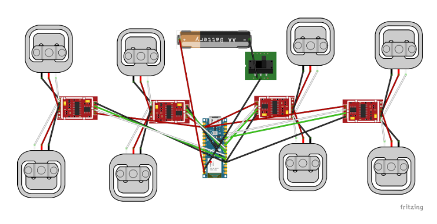

# Biostance Device Assembly Instructions
This document is written for Northwestern DTC 1 Section 5.1.

*Adapted from the docs [here](https://docs.google.com/document/d/1ldEVrvwhGYVu4OGukCBJCGcmKfjVL98Qq2BRzPFvP7Y/edit?usp=sharing): (additional pictures can be found at the link)* 
## Introduction

This document provides step-by-step instructions for reproducing the final Biostance device prototype.  It covers the process from purchasing parts and assembling components to final construction and code implementation.  The device measures and logs a user's percent weight-bearing status over time.

**Estimated Assembly Time:** 9 hours (excluding drying/printing times) for someone proficient in the required techniques with pre-prepared materials.

**Skill Level:** Intermediate to advanced proficiency in 3D printing, soldering, woodworking/plastic cutting, and basic electronics.

**Recommendation:**  Read through *all* instructions and gather *all* materials and tools before starting.

## Parts List

### Components

| Component                       | Quantity | Notes                                                                                                 |
| :------------------------------ | :------- | :---------------------------------------------------------------------------------------------------- |
| 50kg Load Cells                 | 8        |                                                                                                       |
| Microcontroller (ESP32)       | 1        |                                                                                                       |
| PLA Filament (1.75mm)          | 100g     |  Color of your choice                                                                                        |
| 22 Gauge Wire                   | 8 x 1.5ft| Multiple Colors is helpful                                                                                  |
| 22 Gauge Wire                   | 8 x 8in  | Multiple Colors is helpful                                                                             |
| Lithium Cell Battery            | 1        |  Capacity and voltage compatible with your ESP32 (check specifications)                              |
| Battery Charger                 | 1        |  Compatible with your chosen battery                                                                   |
| Grip Tape Roll                  | 1 x 30ft |                                                                                                       |
| Hot Glue Sticks                 | 2        |                                                                                                       |
| Epoxy Packets                   | 8        |                                                                                                       |
| Rubber Feet Package             | 1        |                                                                                                       |
| Rosin Core Solder Wire          | 3g       |                                                                                                       |
| Sturdy Material (Wood/Polycarb) | 3ft x 3ft |                                                         |
| 2 or 3-way Switch                | 1        |                                                                                                       |

### Tools

| Tool                       | Notes                                                                 |
| :-------------------------- | :-------------------------------------------------------------------- |
| 3D Printer                 |  With sufficient build volume for the largest part.                   |
| Bandsaw or Table Saw       |  For cutting the base material.                                        |
| Tape Measure               |                                                                       |
| Ruler                      |                                                                       |
| Soldering Iron             |                                                                       |
| Wire Strippers             |                                                                       |
| Scissors                   |                                                                       |
| Hot Glue Gun               | Optional, but helpful for securing components.                       |
| Multimeter                 | Optional, but helpful for testing connections.                       |
| Razor Blade                |  For cleaning up grip tape edges.                                   |

## Safety Precautions

**Crucially, follow all safety instructions provided with your tools and materials.**  In addition, observe these precautions:

*   **Heat-Based Devices (3D Printer, Soldering Iron, Hot Glue Gun):**
    *   **Do NOT touch heated surfaces (nozzles, beds, etc.) until fully cooled.**
    *   **Do NOT touch melted material (filament, solder, glue) during operation.**
    *   **Allow sufficient cooling time for wires, PCB boards, and components near solder joints.  Heat can conduct through these parts.**
    *   Work in a well-ventilated area.

*   **Cutting Devices (Saws, Wire Strippers, Scissors, Razor Blade, Tape Measure):**
    *   **Exercise extreme caution to avoid cuts from sharp edges.**
    *   **Bandsaws/Table Saws present significant risks. Materials, clothing, or body parts can be caught and pulled into the blade.**
    *   **Operate these saws with *utmost* caution and follow *all* manufacturer safety guidelines.**
    *   Use appropriate safety equipment (eye protection, push sticks, etc.).
    *   Ensure the work area is clear of obstructions.
    *   Never reach over the blade.

* **Epoxy**
    * Work in a well ventilated area.
    * Wear gloves
    * Do not ingest

## Construction Steps

### Step 1: 3D Printing

1.  **File Locations:**
    *   **GitHub (this repository):**
        *   `Top of Box v2.stl`
        *   `Bottom of Box v4.stl` (Adjust file if using different bottom material thickness)
        *   `tip scale v2.stl`
    *   **Thingiverse (patrick3345):**
        *   `50kg Loadcell Bracket versionF`  [Link to Thingiverse page](https://www.thingiverse.com/thing:2624188/files) 

2.  **Printing Instructions:**
    *   Combine all files into a single print job if your build plate is large enough.
    *   **Slicer Settings:**
        *   Wall Thickness: 1.0 mm
        *   Infill: 50%
        *   Supports: Tree-style (auto-generated) 
        *   Recommended Slicers: Cura Slicer, PrusaSlicer, or Bambu Studio (Instructions below use Cura Slicer).
    *   **Placement:** Ensure models are *not* overlapping on the build plate.

4.  **Slice and Upload:** Slice the files using your chosen slicer and upload them to your 3D printer. Follow your printer's specific instructions for uploading files.

5.  **Post-Processing:**
    *   Allow the build plate to cool completely.
    *   Carefully remove the printed parts from the build plate.
    *   Remove any support structures.

### Step 2: Cut Structure Pieces and Assemble Base

1.  **Cutting:** Cut the sturdy material (wood/polycarbonate) into:
    *   One piece: 1.5ft x 3ft
    *   Two pieces: 1.5ft x 1.5ft

3.  **Load Cell Holder Placement:**
    *   Position the eight 3D-printed load cell holders on the *underside* of the 1.5ft x 3ft piece. These should be located where the corners of the 1.5ft x 1.5ft plates will eventually sit (refer to the image in the original instructions, which you should ideally include).
    *   **Securely epoxy the load cell holders in place.** Allow ample drying time according to the epoxy's instructions.

4.  **Rubber Feet:**
    *   Flip the 1.5ft x 3ft piece over.
    *   Attach rubber feet to the *opposite* side (the side *without* the load cell holders).  These should be positioned to align with the load cell holders.
    *   Epoxy the rubber feet in place.

5.  **Grip Tape (Top Pieces):**
    *   Apply grip tape to the *top* surfaces of the two 1.5ft x 1.5ft plates.
    *   Use a razor blade to carefully trim any excess grip tape for clean edges.

6.  **Load Cell Tips:**
    *   Attach the 3D-printed "tip scale v2.stl" pieces to the *top* of the 1.5ft x 1.5ft plates.
    *   Position each tip so it aligns with the *center* of a corresponding load cell holder on the base piece.
    *   Epoxy the tips in place.

### Step 3: Electronics, Wiring, and First Calibration

**Wiring Diagram:** Follow this diagram carefully throughout the wiring process.

**(Figure 1: Electronics wiring diagram displaying the function of each part.** 

1.  **HX711 Modification (80Hz Mode):**
    *   **De-solder the 0 Ohm resistor** from *each* HX711 chip.
    *   **Bridge the 80Hz pads** with solder. This enables faster data transfer (at the cost of some accuracy).

2.  **Load Cell Wiring:** Solder the wires from *each* load cell to its corresponding HX711 module as shown in the wiring diagram.  **The colors of the load cell wires may vary; use a multimeter to identify the correct wires if necessary.**

3.  **HX711 Wire Lengths:**
    *   Attach approximately 1.3ft wires to the `VCC`, `GND`, `DT`, and `SCK` pins on *two* of the HX711 boards.  These will be the "outer" boards.
    *   Attach 8-inch wires to the `VCC`, `GND`, `DT`, and `SCK` pins on the other *two* HX711 boards.
    *   Place all load cells into their holders on the bottom piece, with the wires facing upwards.

4.  **HX711 to ESP32 Connections:**
    *   Solder the `DT` (Data) and `SCK` (Clock) pins from each HX711 to the appropriate GPIO pins on your ESP32, according to the wiring diagram.
    *   **If you use a different ESP32 board, you can choose different GPIO pins, but *you must update the pin numbers in the code accordingly*.**
    *   Connect all HX711 `VCC` pins together and then to a 3.3V or 5V pin on the ESP32 (depending on your ESP32's specifications and the HX711 operating voltage - check datasheets!).
    *   Connect all HX711 `GND` pins together and then to a `GND` pin on the ESP32.

5.  **Battery and Switch Wiring:**
    *   Solder the *negative* (-) wire from the battery connector to one terminal of the switch.
    *   Solder a wire from the *other* terminal of the switch to the `GND` pin of the ESP32.
    *   Solder the *positive* (+) wire from the battery connector to the `Vin` pin on the ESP32.
    *   **CRITICAL WARNING:** **If your battery voltage exceeds the ESP32's maximum input voltage (check the ESP32 datasheet!), you *must* add a voltage regulator (e.g., a 5V regulator) between the battery and the ESP32's `Vin` pin.  Failure to do so will damage the ESP32 and could cause a fire.**

6.  **Calibration (Test Code):**
    *   Upload the test code (link to the test code in your GitHub repository) to the ESP32 using the Arduino IDE 2.x.
    *   **Arduino IDE Setup:**
        *   Ensure you have the ESP32 board definitions installed in the Arduino IDE.
        *   Select the correct ESP32 board and port.
        *   Set the "Partition Scheme" to a large enough size to accommodate the compiled code.
    *   **Calibration Procedure:** Follow the instructions *within the test code* to determine the calibration factor for *each* HX711.  Each HX711 represents a full Wheatstone bridge formed by two half-bridge load cells.  You'll likely need to place known weights on the scale to calibrate.  *Record these calibration factors; you'll need them later.*

### Step 4: Final Assembly

1.  **Box Attachment:** Epoxy the 3D-printed electronics box to the back of the bottom (1.5ft x 3ft) sheet.

2.  **Scale Top Attachment:** Carefully place the individual scale tops (1.5ft x 1.5ft pieces with grip tape and tips) onto the load cell sensors.  Ensure proper alignment. Epoxy this on top.
3.  **Wiring Management:**
    *   Carefully route the excess wiring into the 3D-printed electronics box.
    *   Securely mount the switch and battery connector to their respective holes in the box.
    *   Position the ESP32 and battery inside the box. You may want to use hot glue or other non-permanent adhesive to keep them from rattling around.

4.  **Final Code Upload:**
    *   Upload the final code to the ESP32.
    *   **Update the code with:**
        *   The correct GPIO pin numbers (if you used different pins than the example code).
        *   The calibration factors you determined in Step 3.6.

5.  **Box Top:** Epoxy the top of the 3D-printed box in place.

6.  **Final Grip Tape:** Apply grip tape around the sides of the device for aesthetics and to encourage users to lift it from the bottom.

## Conclusion

The Biostance device should now be complete. Thoroughly test all aspects of the device, including weight measurement and data logging. Ensure the graphs are working correctly.
